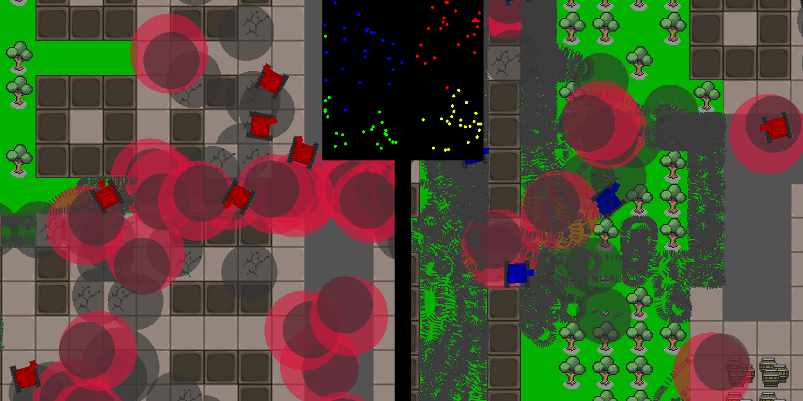

# Tanks_2016

  

## About
**'Tanks'** is split screen cooperative game about eliminating enemy tanks. Large and diverse maps with the possibility of complete destruction of landscape elements make every match different. Chaotic movement (yet) of opponents adds unpredictability and unique gameplay.

## Instruction
- To play **'Tanks'**, download and unpack _Tanks Alfa 0.1.9.zip_ archive, then run the file _Tanks.exe_
- To win, destroy your opponent's power supply and (of course) as many of his tanks as possible.
- You can change team by pressing movement button in the colour of your choice during the control presentation screen.
- Controls: 
  - Player I: movement: WASD; tower rotation: FH; fire: G
  - Player II: movement: arrows; tower rotation: ,(<) .(>) ; fire: /
  

  
   
  

